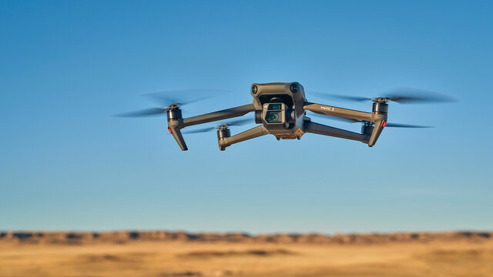
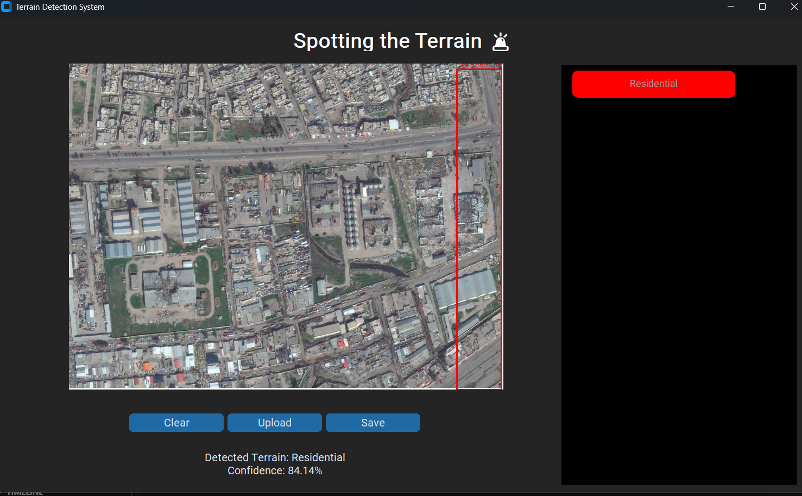

# 🛰️ Image-Based Terrain Recognition System for Autonomous Drones

## 📌 Description



This project presents a **CustomTkinter-based desktop application** that detects and classifies various terrain types from aerial images and videos using deep learning. It is designed to support **autonomous drone systems** in recognizing environments like forests, roads, water bodies, and more.

🔔 The application includes an **alert system** that notifies the user when a selected terrain type is detected.

### ✅ Key Features
- Upload images or videos for terrain detection.
- Select specific terrain types to receive alerts.
- Get **audio-visual alerts** using `pyttsx3` for selected terrain.
- Save detection results for future reference.

---

## 🧭 Detected Terrain Classes

- AnnualCrop  
- Forest  
- HerbaceousVegetation  
- Highway  
- Industrial  
- Pasture  
- PermanentCrop  
- Residential  
- River  
- SeaLake  

---

## 🖼️ Example Image



---

## 🚀 Getting Started

1. Clone this repository:
   ```bash
   git clone [<your-repo-url>](https://github.com/GopikaR07/drone.git)
   ```
2. Install dependencies:
   ```bash
   pip install -r requirements.txt
   ```
3. Run the application:
   ```bash
   python final.py
   ```

4. Sign in and configure terrain alert preferences.
5. Upload an image or video and begin detection.

---

## ⚙️ Modules Overview

| Module              | Functionality                              |
|---------------------|---------------------------------------------|
| `final.py`           | Launches the GUI
|
|                      | Runs YOLOv8-based terrain detection         |
|                      | Manages user alert preferences              |
|                      | Handles audio alerts                        |

---

## 📂 Dataset

We used a labeled dataset inspired by **EuroSAT** and other drone-based terrain datasets, covering diverse terrains under various conditions. Data was split into **train** and **validation** folders for model training.

---

## 🧠 Models

The primary detection models used:

- **YOLOv8-Small** (mAP@0.5: `0.91`, Inference Time: `1.2 ms`)
- **YOLOv8-Large** (mAP@0.5: `0.94`, Inference Time: `3.5 ms`)

✅ Only user-selected terrains will trigger alerts.

---

## 🏁 Conclusion

This GUI-based system accurately detects terrains from drone imagery using YOLOv8, offering **real-time detection** and **selective alerts**, enabling smarter and safer navigation for autonomous drones.

---

## 📦 Dataset Source
🔗 [Google Drive Dataset](https://drive.google.com/file/d/1pnK5brwQcKe2_IViN4_ZAu1AgCYm3Jyn/view?usp=drive_link)
